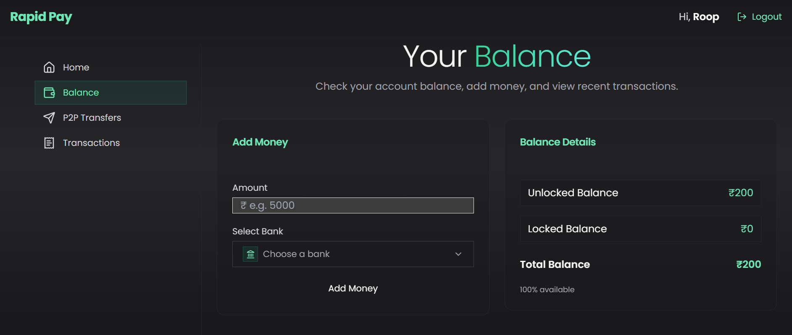
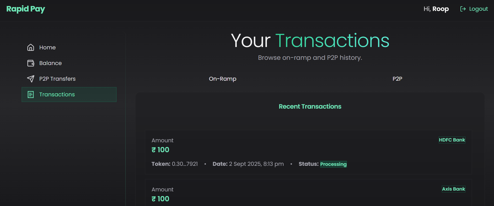
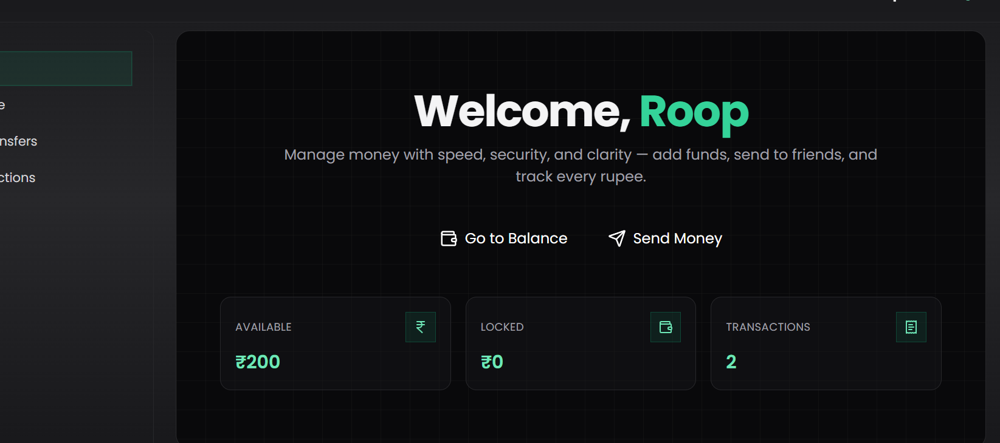

# RapidPay — Modern Online Banking App (Next.js, Prisma, PostgreSQL)

> A clean, modern “online banking” demo with on‑ramp deposits, P2P transfers, balances, and transaction history — built with **Next.js 14**, **TypeScript**, **Tailwind CSS**, **Prisma**, and **PostgreSQL**.


---

## Table of Contents
- [Overview](#overview)
- [Screenshots](#screenshots)
- [Features](#features)
- [Tech Stack](#tech-stack)
- [System Architecture](#system-architecture)
- [Getting Started](#getting-started)
- [Scripts](#scripts)
- [Core Flows](#core-flows)
- [API Reference](#api-reference)
- [Accessibility & Performance](#accessibility--performance)
- [Testing](#testing)
- [Security Notes](#security-notes)

---

## Overview
**RapidPay** is a full‑stack banking demo that mirrors real‑world money app flows:
- Add money (on‑ramp) via supported providers
- Peer‑to‑Peer transfers by **recipient name**
- Live balance with locked amounts for in‑flight operations
- Transaction history with statuses

The app is responsive across all screen sizes and uses a clean, minimal design.

---

## Screenshots




---

## Features
- 🔐 **Auth**: NextAuth (GitHub OAuth; email/password optional)
- 🏦 **Balance & Locking**: Safe updates with Prisma transactions
- 💳 **On‑Ramp**: Start → processing → success/failure statuses
- 🔁 **P2P Transfers**: Send money using recipient **name** (unique constraint recommended)
- 📜 **Transactions**: On‑ramp + P2P history
- 🧱 **Components**: Top bar (session‑aware), Sidebar (Home/Transfer/Transactions), Balance card, Transfer form, OnRampTransaction card
- 📱 **Responsive**: Mobile‑first layout

---

## Tech Stack
- **Frontend**: Next.js 14 (App Router), React 18, TypeScript, Tailwind CSS, shadcn/ui
- **Auth**: NextAuth.js (GitHub provider configured)
- **ORM & DB**: Prisma + PostgreSQL
- **Runtime**: Node.js 18+

---

## System Architecture
- **Client** renders pages/components → calls **/api** routes
- **API** routes validate input & call **services** in `/lib/actions`
- **Services** use **Prisma** to read/write PostgreSQL within **transactions**
- **NextAuth** manages session & providers
- **UI** reads server data via server components/server actions where appropriate

```
Client UI → Next.js API Routes → Service/Action Layer → Prisma → PostgreSQL
                           ↘ NextAuth (session & OAuth)
```

---

## Getting Started

### 1) Prerequisites
- Node.js 18+
- pnpm / npm / yarn
- PostgreSQL 14+ (or Docker)
```

### 2) Install deps
```bash
pnpm install
# or npm install / yarn
```

### 3) Prisma init & migrate
```bash
npm prisma generate
npm prisma migrate dev --name init
# Optional: npm prisma studio
```

> **Seeding:** You opted not to maintain a `seed.ts`. If needed later, add one under `prisma/seed.ts` and run `ppm prisma db seed`.

### 4) Run dev
```bash
npm dev
```

### 5) Build & start (production)
```bash
npm build
npm start
```

---

## Scripts

```json
{
  "scripts": {
    "dev": "next dev",
    "build": "next build",
    "start": "next start",
    "lint": "next lint",
    "prisma:generate": "prisma generate",
    "prisma:migrate": "prisma migrate dev",
    "prisma:studio": "prisma studio"
  }
}
```

---

## Core Flows

### 1) Add Money (On‑Ramp)
- User selects a provider in **AddMoneyCard**
- Backend creates an `OnrampTransaction` with `processing` status and a `token`
- Provider/webhook (future) confirms → status becomes `success` or `failure`
- On success: increase `Balance.amount` & clear `locked` if applicable

### 2) P2P Transfer
- Inputs: **recipient name** and **amount**
- Validate sender balance (consider `locked`)
- Run a **Prisma transaction**:
  - Decrement sender `Balance.amount`
  - Increment recipient `Balance.amount`
  - Insert `P2PTransfer`
- Return updated balances

### 3) Transactions View
- List `OnrampTransaction` + `P2PTransfer`
- Outbound vs inbound styling; show amounts and timestamps

---

## API Reference

> Endpoints may change; keep this section aligned with your `/app/api` routes.

### `POST /api/onramp/start`
**Body**
```json
{ "provider": "bankX", "amount": 5000 }
```
**Response**
```json
{ "transactionId": "txn_123", "status": "processing", "token": "abc123" }
```

### `POST /api/p2p/transfer`
**Body**
```json
{ "toName": "Alice", "amount": 1200 }
```
**Response**
```json
{ "ok": true, "transferId": "tr_456", "balance": { "amount": 8800, "locked": 0 } }
```

### `GET /api/user/balance`
**Response**
```json
{ "amount": 10000, "locked": 0 }
```

---


## Accessibility & Performance
- Semantic HTML for cards, lists, and buttons
- Focus states & keyboard navigation
- Avoid large client bundles; prefer server components where possible

---

## Testing
- **Unit**: Jest + React Testing Library (components & actions)

---

## Security Notes
- Use **Prisma transactions** to prevent race conditions in balance updates
- Validate/limit amounts server‑side; never trust client input
- Protect API routes with session checks (`NextAuth`)
- Log and verify provider callbacks for on‑ramp
---


